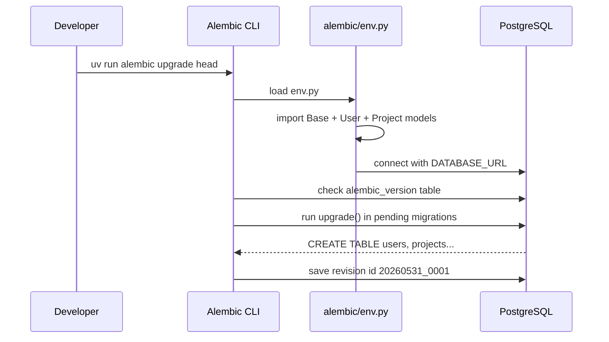
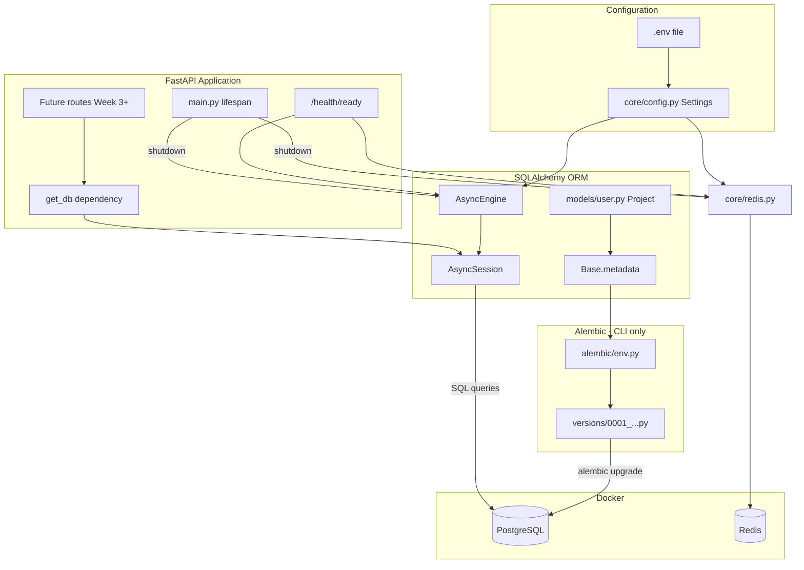
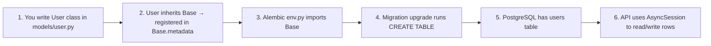
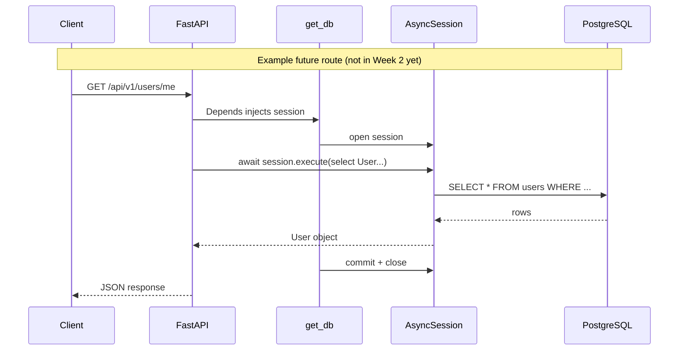

# 02 — SQLAlchemy Async & Alembic

> **Audience:** Junior Python developers. This doc explains *what* each piece does and *how* they connect.

## What We Built (Week 2)

- **SQLAlchemy 2.x async** — talk to PostgreSQL without blocking the API
- **ORM models** — `User` and `Project` (Python classes that represent tables)
- **Alembic** — version-controlled SQL schema changes (migrations)
- **Redis stub** — minimal client setup + health check only (no business logic yet)
- **`GET /api/v1/health/ready`** — confirms Postgres and Redis are reachable

---

## 1. What is Alembic? (and each file in its folder)

### Simple analogy

Think of your **database schema** (tables, columns, indexes) like the blueprint of a house.

- **SQLAlchemy models** = the blueprint you draw in Python
- **Alembic** = a **construction log** — each migration is one approved change to the real house (PostgreSQL)

You never ALTER TABLE by hand in production. You write a migration, run it, and Alembic records that version was applied.

### Folder structure

```
api/
├── alembic.ini              ← Main config file (where scripts live, logging)
└── alembic/
    ├── env.py               ← How Alembic connects to YOUR app and database
    ├── script.py.mako       ← Template for NEW migration files
    └── versions/
        └── 20260531_0001_create_users_and_projects.py   ← One migration = one change set
```

| File | What it does |
|------|----------------|
| **`alembic.ini`** | Entry point for the `alembic` CLI. Points to the `alembic/` folder. The `sqlalchemy.url` here is overridden by `env.py` with your `.env` value. |
| **`alembic/env.py`** | **Bridge between Alembic and your app.** Imports `Base` and all models so Alembic knows your tables. Reads `DATABASE_URL` from settings. Runs migrations using async SQLAlchemy (same as the API). |
| **`alembic/script.py.mako`** | Boilerplate template. When you run `alembic revision`, Alembic copies this file and fills in `upgrade()` / `downgrade()`. |
| **`alembic/versions/*.py`** | **Each file = one migration.** Contains `revision` id, `down_revision` (parent), `upgrade()` (apply changes), `downgrade()` (undo changes). |

### What happens when you run `alembic upgrade head`?



Alembic creates a small table called **`alembic_version`** in Postgres. It stores one row: the current migration id. Next time you upgrade, it only runs migrations newer than that id.

### `upgrade()` vs `downgrade()`

```python
def upgrade() -> None:
    # Move schema FORWARD (create tables, add columns)
    op.create_table("users", ...)

def downgrade() -> None:
    # Move schema BACKWARD (undo the migration)
    op.drop_table("users")
```

---

## 2. SQLAlchemy: `Mapped`, `mapped_column`, and related pieces

SQLAlchemy **ORM** (Object-Relational Mapper) lets you use **Python classes** instead of writing raw SQL for every query.

### The main pieces

| Name | Role | Simple explanation |
|------|------|--------------------|
| **`Base`** | Registry of all models | Every model class inherits from `Base`. SQLAlchemy collects them into `Base.metadata` (a catalog of tables). |
| **`Mapped[T]`** | Type hint for a column | Tells Python *and* SQLAlchemy: "this attribute is a column of type `T`". Example: `Mapped[str]` = text column. `Mapped[str \| None]` = optional text. |
| **`mapped_column(...)`** | Column definition | Describes the real SQL column: type, unique, index, default, nullable. |
| **`__tablename__`** | Table name in Postgres | Class `User` → table `"users"`. |
| **`AsyncSession`** | Conversation with DB | Object you use to `add`, `query`, `commit` changes. One session per HTTP request (via `get_db()`). |
| **`AsyncEngine`** | Connection pool | Manages many connections to Postgres efficiently. Created once at startup. |

### Example from our code

```python
class User(Base, TimestampMixin):
    __tablename__ = "users"

    email: Mapped[str] = mapped_column(String(320), unique=True, index=True)
```

Read this line by line:

1. **`class User(Base, TimestampMixin)`** — `User` is a model. It gets `id`, `created_at`, `updated_at` from `TimestampMixin`.
2. **`__tablename__ = "users"`** — In PostgreSQL the table is named `users` (plural is a common convention).
3. **`email: Mapped[str]`** — In Python, `user.email` is a `str`. Mypy/IDE understand this.
4. **`mapped_column(String(320), unique=True, index=True)`** — In SQL: `VARCHAR(320) UNIQUE`, with an index for faster lookups.

### Other types you will see

| SQLAlchemy piece | Used for |
|------------------|----------|
| `String(255)` | Short text (`VARCHAR`) |
| `Text` | Long text (descriptions) |
| `Boolean` | `true` / `false` |
| `Enum(UserRole, ...)` | Fixed set of values (`admin`, `user`) |
| `UUID(as_uuid=True)` | Primary keys as UUIDs |
| `DateTime(timezone=True)` | Timestamps with timezone |
| `func.now()` | Server default: `now()` in SQL |

### `TimestampMixin` — reuse columns across models

```python
class TimestampMixin:
    id: Mapped[uuid.UUID] = mapped_column(UUID(as_uuid=True), primary_key=True, default=uuid.uuid4)
    created_at: Mapped[datetime] = mapped_column(DateTime(timezone=True), server_default=func.now())
    updated_at: Mapped[datetime] = mapped_column(DateTime(timezone=True), server_default=func.now(), onupdate=func.now())
```

Both `User` and `Project` inherit this — you write it once, every model gets the same `id` + timestamps pattern.

### Models vs migrations — important distinction

| | Python model (`models/user.py`) | Alembic migration (`versions/...py`) |
|---|--------------------------------|--------------------------------------|
| **Purpose** | How your **app** thinks about data | How **Postgres** is actually changed |
| **When it runs** | Every API request (via session) | When you run `alembic upgrade` |
| **Must match?** | Yes — column names and types should stay in sync | You create a new migration when the model changes |

**Week 2:** We wrote the migration by hand. Later you can use `alembic revision --autogenerate` to compare models vs database and suggest a migration (always review before applying).

---

## 3. What Redis phase did we start? (configuration only)

**Short answer:** Week 2 Redis is **setup + health check only**. No caching, Celery, or rate limiting yet.

### What exists today

| Piece | File | What it does |
|-------|------|----------------|
| Config | `core/config.py` → `redis_url` | Reads `REDIS_URL` from `.env` (default `redis://localhost:6379/0`) |
| Client | `core/redis.py` → `get_redis()` | Creates one shared async Redis connection (lazy: first use) |
| Health | `check_redis_connection()` | Sends `PING` to Redis — used by `/health/ready` |
| Shutdown | `close_redis()` | Closes connection when API stops (`main.py` lifespan) |
| Docker | `docker-compose.yml` | Runs Redis 7 container locally |

### What Redis will do in later weeks (not built yet)

| Week | Redis role |
|------|------------|
| Week 8 | **Celery broker** — background jobs (embedding KnowledgeNeurons) |
| Week 9 | **Query embedding cache** — avoid calling Voyage AI twice for the same search |
| Week 22 | **Rate limiting** + **JWT token blacklist** on logout |

So Redis is running in Docker and the API can **prove** it can talk to Redis — but **no feature stores data in Redis yet**.

---

## 4. Full flow: how everything connects

### Big picture



### Step-by-step: from model class to real table



**Detailed steps:**

1. **Define model** — `class User(Base, TimestampMixin)` describes columns in Python.
2. **Register metadata** — Importing `User` in `models/__init__.py` attaches the table definition to `Base.metadata`.
3. **Migrate** — `alembic upgrade` runs SQL from `versions/20260531_0001_....py` and creates physical tables.
4. **Runtime** — When a route uses `session: AsyncSession = Depends(get_db)`:
   - FastAPI calls `get_db()`
   - You get a session bound to the engine
   - You can do `await session.get(User, user_id)` or `session.add(new_user)`
   - On success, `get_db` commits; on error, it rolls back

### Request flow (Week 3+ will use `get_db`; Week 2 only uses it for health)



Week 2 only wires `get_db()` — no user routes yet. The health endpoint checks the engine with `SELECT 1`, not the ORM.

### File map (what talks to what)

```
core/config.py          → DATABASE_URL, REDIS_URL from .env
        ↓
core/database.py        → Engine + Session + get_db()
        ↓
models/*.py             → Table definitions (Python side)
        ↓
alembic/versions/*.py   → CREATE TABLE (SQL side, run once per migration)
        ↓
PostgreSQL              → Real data lives here

core/redis.py           → Redis client (health only for now)
        ↓
Redis container         → In-memory store (used more in Week 8+)
```

---

## Async SQLAlchemy (why `async` everywhere?)

FastAPI is async. If the database driver blocked the thread while waiting for Postgres, your API could handle fewer requests at once.

- **`create_async_engine`** + **`asyncpg`** = non-blocking Postgres driver
- Every DB call needs **`await`**: `await session.execute(...)`, `await session.commit()`

```python
# Sync (old style) — blocks
user = session.query(User).first()

# Async (our style) — other requests can run while waiting
result = await session.execute(select(User).where(User.email == email))
user = result.scalar_one_or_none()
```

---

## Readiness vs Liveness

| Endpoint | Question it answers |
|----------|---------------------|
| `GET /api/v1/health` | Is the Python process running? |
| `GET /api/v1/health/ready` | Can we serve real traffic? (DB + Redis OK) |

Returns **503** if database or Redis is down — useful for Docker/Kubernetes to know the app is not ready yet.

---

## Commands cheat sheet

```bash
# Start Postgres + Redis
docker compose up -d

# Apply all pending migrations
uv run alembic upgrade head

# See current migration version
uv run alembic current

# Undo last migration
uv run alembic downgrade -1 

# Create a new migration (after changing models) — review before applying!
uv run alembic revision --autogenerate -m "add memberships table"
```

---

## Further Reading

- [SQLAlchemy 2.0 ORM Quickstart](https://docs.sqlalchemy.org/en/20/orm/quickstart.html)
- [SQLAlchemy 2.0 Async](https://docs.sqlalchemy.org/en/20/orm/extensions/asyncio.html)
- [Alembic tutorial](https://alembic.sqlalchemy.org/en/latest/tutorial.html)
- [Mapped Column (SQLAlchemy 2 style)](https://docs.sqlalchemy.org/en/20/orm/mapping_styles.html#mapped-column-derived-from-column)

---

## Exercises (Optional)

1. Open `psql` or a DB GUI and inspect the `users` and `projects` tables after running migrations.
2. Add a `ProjectMembership` model and generate a second Alembic migration.
3. Trace `get_db()` in the FastAPI docs — understand `yield` and why commit happens after the route finishes.
