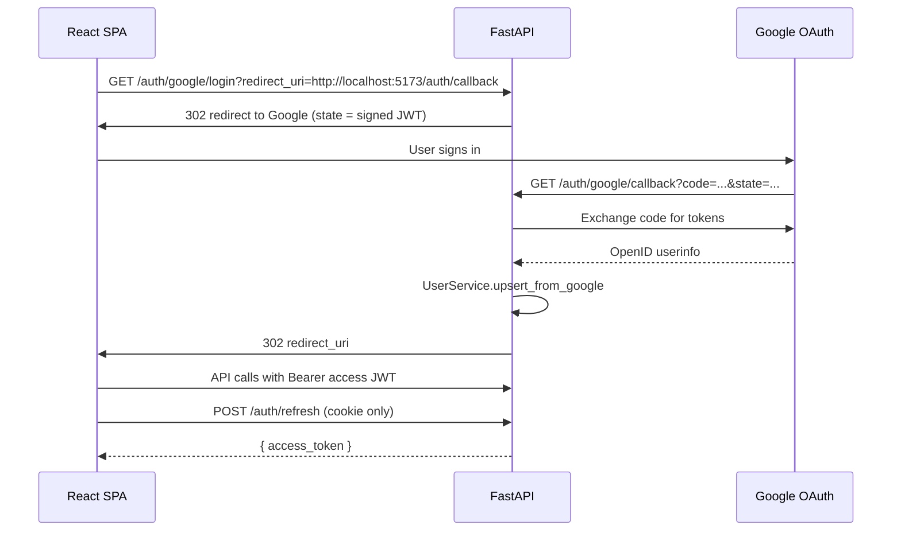

# 03 — Google OAuth & JWT (SPA Auth)

> **Audience:** Junior Python developers. Week 3 adds login for the React SPA (Week 15). MCP agent OAuth is deferred to Week 12.

## What We Built

- **Google OAuth 2.0** authorization code flow (backend handles the callback)
- **JWT access tokens** returned to the SPA in a URL fragment (`#token=...`)
- **httpOnly refresh cookie** for silent token renewal
- **`OAuthService`**, **`OAuthFlowService`**, **`JWTService`**, **`UserService`**
- **`get_current_user`** FastAPI dependency (Bearer JWT) — no global auth middleware
- Endpoints: login redirect, callback, refresh, logout, `GET /auth/me`

---

## 1. Why two tokens?

| Token | Where it lives | Lifetime | Purpose |
|-------|----------------|----------|---------|
| **Access (JWT)** | SPA memory (Zustand); delivered via `#token=` once | ~15 min | Sent as `Authorization: Bearer` on API calls |
| **Refresh (JWT)** | httpOnly cookie on API domain | ~7 days | `POST /auth/refresh` issues a new access token |

Access tokens in the **fragment** (`#`) are never sent to the server on navigation — only JavaScript on the callback page reads them. Refresh tokens never touch `localStorage`, which reduces XSS risk.

Week 22 adds a **Redis JWT blacklist** on logout; Week 3 clears the cookie and relies on short access-token expiry.

---

## 2. SPA OAuth flow (sequence)



**`redirect_uri` validation:** The SPA passes its callback URL; the API only allows values listed in `CORS_ORIGINS` (same hosts as the SPA).

**`state`:** A short-lived signed JWT binding the Google round-trip to the SPA `redirect_uri` (CSRF protection).

---

## 3. Service responsibilities

| Service | File | Role |
|---------|------|------|
| `OAuthService` | `services/oauth.py` | Build Google authorize URL; exchange code; fetch userinfo (Authlib + httpx) |
| `OAuthFlowService` | `services/oauth_flow.py` | Login redirect, callback orchestration, SPA redirect + cookie |
| `JWTService` | `services/jwt.py` | Issue/verify access, refresh, and OAuth state tokens |
| `UserService` | `services/user.py` | Upsert `User` by `google_sub` on first login |

Controllers in `api/v1/auth.py` stay thin: parse HTTP, call services, set cookies.

---

## 4. `get_current_user` vs middleware

```python
@router.get("/auth/me")
async def me(user: User = Depends(get_current_user)) -> UserResponse:
    ...
```

- **Depends** runs per route — public routes omit it.
- **No global JWT middleware** — avoids breaking OAuth redirects and unauthenticated health checks.
- Week 12 **`MCPAuthMiddleware`** applies only to `/mcp`, not REST.

---

## 5. Cookie security

| Flag | Dev | Production |
|------|-----|------------|
| `HttpOnly` | yes | yes |
| `Secure` | false (localhost) | true (HTTPS) |
| `SameSite` | `lax` | `lax` |
| `Path` | `/api/v1/auth` | `/api/v1/auth` |

`CORSMiddleware` uses `allow_credentials=True` so the SPA can call `/auth/refresh` with cookies.

---

## 6. Local setup (Google Cloud Console)

1. Create an OAuth 2.0 **Web application** client.
2. **Authorized redirect URI:** `http://localhost:8000/api/v1/auth/google/callback`
3. Copy Client ID and Secret into `api/.env`:

```env
GOOGLE_CLIENT_ID=...
GOOGLE_CLIENT_SECRET=...
GOOGLE_REDIRECT_URI=http://localhost:8000/api/v1/auth/google/callback
JWT_SECRET_KEY=<openssl rand -hex 32>
```

4. Start API + SPA; open `http://localhost:5173/login` (Week 16) or hit login URL manually.

---

## Code Walkthrough

1. **`api/v1/auth.py`** — HTTP surface: login, callback, refresh, logout, `/me`.
2. **`services/oauth_flow.py`** — Wires OAuth + JWT + User upsert; builds fragment redirect.
3. **`core/deps.py`** — `HTTPBearer` + `JWTService.verify_access_token` + DB user load.

---

## Further Reading

- [Google OAuth 2.0](https://developers.google.com/identity/protocols/oauth2)
- [Authlib](https://docs.authlib.org/)
- [PyJWT](https://pyjwt.readthedocs.io/)
- [FastAPI Security](https://fastapi.tiangolo.com/tutorial/security/)

## Exercises (Optional)

1. Add `GET /auth/me` fields for project count (join `project_memberships`).
2. Log failed `state` verification with structured logging before Week 22 Sentry.
