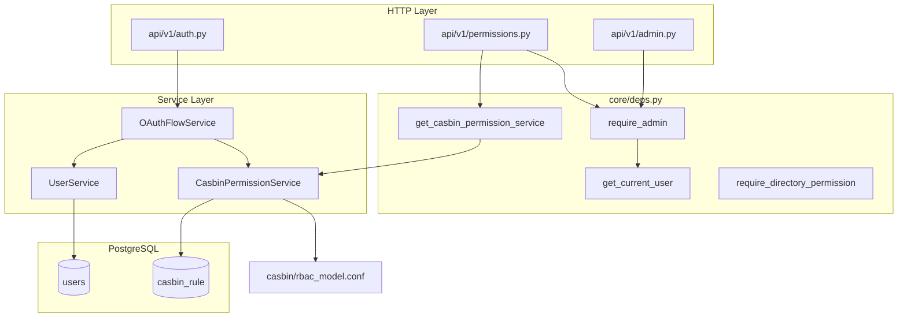
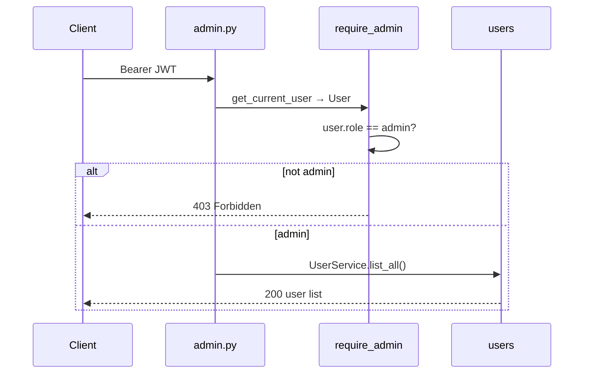
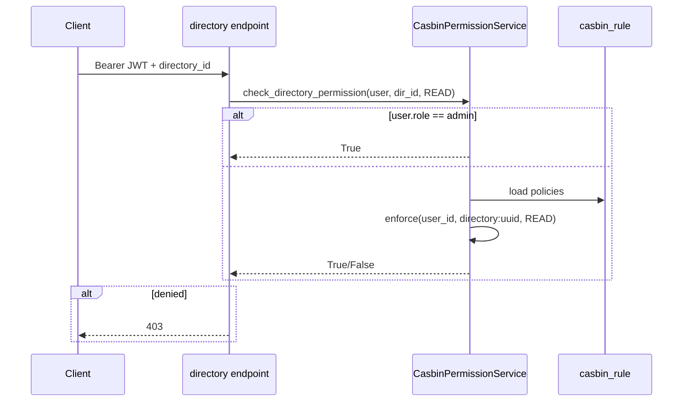

# 04 — RBAC with PyCasbin

> **Audience:** Junior Python developers. Week 4 adds **authorization** on top of Week 3 **authentication**. Directories ship in Week 5; this week wires the permission engine and admin gates.

## What We Built

- **PyCasbin** (`casbin`) with **casbin-async-sqlalchemy-adapter** — policies stored in PostgreSQL (`casbin_rule` table)
- **`CasbinPermissionService`** — enforce roles and directory permissions
- **Roles:** `admin`, `user` (mirrored from `users.role` into Casbin grouping policies)
- **Directory permissions:** `READ`, `WRITE`, `MANAGE` (with implicit hierarchy: MANAGE ⊃ WRITE ⊃ READ)
- **FastAPI deps:** `require_admin`, `require_directory_permission(...)`, `get_casbin_permission_service`
- **Endpoints:** `GET /admin/users`, `GET /permissions/me`, grant/revoke directory permissions (admin)
- **Login hook:** `OAuthFlowService` syncs user role into Casbin after Google upsert

---

## 1. Authentication vs authorization

| Layer | Question | Week | Mechanism |
|-------|----------|------|-----------|
| **Authentication** | *Who are you?* | 3 | Google OAuth → JWT → `get_current_user` |
| **Authorization** | *What may you do?* | 4 | Casbin `enforce(sub, obj, act)` |

Week 3 proves identity. Week 4 decides access **after** identity is known.

---

## 2. Libraries

### PyCasbin (`casbin`)

Open-source authorization library. You define a **model** (rules of evaluation) and **policies** (who can do what). At runtime:

```python
enforcer.enforce(subject, object, action)  # True = allow, False = deny
```

`enforce` is **synchronous** (CPU-bound rule matching). Policy load/save uses **async** methods on `AsyncEnforcer`.

### casbin-async-sqlalchemy-adapter

Bridges Casbin to SQLAlchemy. Policies are rows in `casbin_rule`:

| Column | Meaning |
|--------|---------|
| `ptype` | Policy type: `p` (permission) or `g` (grouping / role) |
| `v0`–`v5` | Rule fields (subject, object, action, …) |

We pass the **request DB session** so grant/revoke shares the same transaction as the REST handler.

### RBAC (Role-Based Access Control)

Users get **roles**; roles (or users directly) get **permissions**:

```
g, <user-uuid>, admin     # grouping: user has admin role
p, admin, *, *            # policy: admin may do anything
p, <user-uuid>, directory:<dir-uuid>, READ   # direct directory grant
```

**RBAC** here means: check role inheritance (`g`) plus direct policies (`p`).

---

## 3. Casbin model (`casbin/rbac_model.conf`)

```ini
[request_definition]
r = sub, obj, act

[policy_definition]
p = sub, obj, act

[role_definition]
g = _, _

[policy_effect]
e = some(where (p.eft == allow))

[matchers]
m = g(r.sub, "admin") || (r.sub == p.sub && r.obj == p.obj && (... hierarchy ...))
```

| Part | Meaning |
|------|---------|
| `r = sub, obj, act` | Each check: *subject*, *object*, *action* |
| `p = sub, obj, act` | Stored allow rules |
| `g = _, _` | Role assignment: user → role |
| `m = ...` | Matcher: admin bypass OR direct user policy with READ/WRITE/MANAGE hierarchy |

**Object naming:** directories use `directory:{uuid}`. Admins use object `*` and action `*`.

---

## 4. File map and connections



| File | Role |
|------|------|
| `casbin/rbac_model.conf` | Casbin matcher and RBAC structure (read-only config) |
| `models/casbin_rule.py` | ORM model for `casbin_rule` (Alembic-managed) |
| `services/casbin_permission.py` | Business logic: enforce, grant, revoke, sync role |
| `core/deps.py` | FastAPI wiring: services + `require_admin` / directory checks |
| `api/v1/admin.py` | Admin-only routes (`GET /admin/users`) |
| `api/v1/permissions.py` | Grant/revoke/list directory permissions |
| `services/oauth_flow.py` | After login, `sync_user_role(user)` |
| `main.py` | Startup: seed `p, admin, *, *` policy |

---

## 5. Request flow examples

### Admin gate (`GET /admin/users`)



`require_admin` checks `users.role` in the database (fast). Casbin also knows admin via `g` + `p, admin, *, *` for `enforce` calls.

### Directory permission check (Week 5+ endpoints)



Usage in a future directory route:

```python
@router.get("/directories/{directory_id}")
async def get_directory(
    user: Annotated[User, Depends(require_directory_permission(DirectoryPermission.READ))],
):
    ...
```

### Grant permission (admin)

1. `POST /permissions/directories/{directory_id}` with `{ user_id, permission }`
2. `require_admin` → 403 if not admin
3. `CasbinPermissionService.grant_directory_permission` → `add_policy` → row in `casbin_rule`
4. Response `204`; duplicate grant → `409`

---

## 6. Permission hierarchy

| Granted | Also allows |
|---------|-------------|
| `READ` | — |
| `WRITE` | `READ` |
| `MANAGE` | `READ`, `WRITE` |

Encoded in the Casbin matcher (not separate rows). Week 6 directory API reuses the same checks.

---

## 7. Policy reload

`CasbinPermissionService` caches one `AsyncEnforcer` per request. Grant/revoke in the **same request** updates the in-memory model via `add_policy` / `remove_policy`.

If another process changes policies, call `reload_policy()` (Week 6 permission UI will use this after bulk changes).

---

## Local setup

```bash
cd api
uv sync --all-extras --dev
uv run alembic upgrade head   # creates casbin_rule table
uv run uvicorn knowledge_ai.main:app --reload --port 8000
```

On startup, `lifespan` seeds `p, admin, *, *` if missing. Promote a user to admin in TablePlus:

```sql
UPDATE users SET role = 'admin' WHERE email = 'you@example.com';
```

Re-login so `sync_user_role` writes `g, <uuid>, admin` into `casbin_rule`.

---

## Code Walkthrough

1. **`services/casbin_permission.py`** — Enforcer lifecycle, `enforce`, grant/revoke, role sync.
2. **`core/deps.py`** — `require_admin` and `require_directory_permission` factories.
3. **`api/v1/permissions.py`** — HTTP surface for directory policy CRUD.

---

## Further Reading

- [PyCasbin](https://casbin.org/docs/overview)
- [RBAC model](https://casbin.org/docs/rbac)
- [casbin-async-sqlalchemy-adapter](https://github.com/officialpycasbin/async-sqlalchemy-adapter)
- [FastAPI Dependencies](https://fastapi.tiangolo.com/tutorial/dependencies/)

## Exercises (Optional)

1. Add `GET /permissions/users/{user_id}` (admin) listing another user's directory grants.
2. When `UserService` changes `role` (Week 11), call `sync_user_role` and document the reload path.
