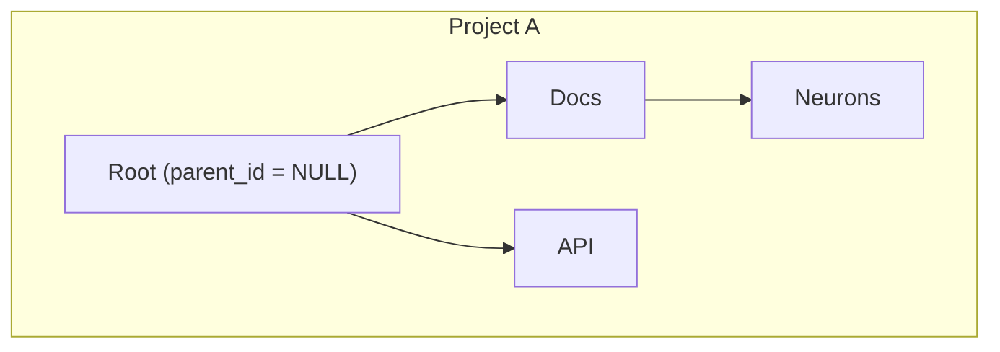
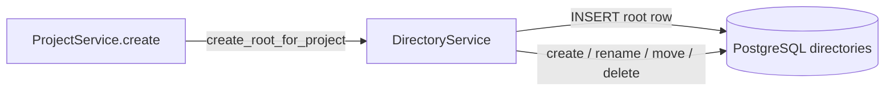
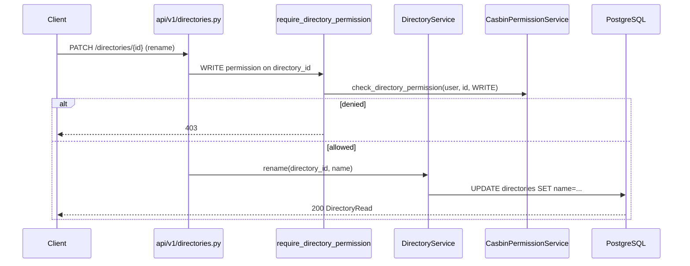

# 05 — Hierarchical Data Trees

> **Audience:** Junior Python developers. Week 5 adds the **directory domain model** — the tree that will hold KnowledgeNeurons and Commands. Week 6 exposes it over REST with Casbin permission checks.

## What We Built

- **`directories` table** — adjacency-list tree (`parent_id`), scoped to `project_id`
- **`Directory` ORM model** — self-referential relationships, one root per project
- **`DirectoryService`** — create, rename, move, delete (with cascade and cycle rules)
- **`ProjectService.create`** — project creation hook that auto-creates a root directory named `"Root"`
- **Alembic migration** — `20260613_0001_add_directories_table`
- **Pydantic schemas** — `DirectoryRead`, `DirectoryCreate`, `DirectoryRename`, `DirectoryMove` (for Week 6 API)

No HTTP routes yet — Week 6 adds `/api/v1/directories/*` and wires `require_directory_permission`.

---

## 1. Why a tree?

Knowledge-AI organizes documents (**KnowledgeNeurons**) and reusable snippets (**Commands**) in folders, like a file system. Each **Project** gets its own tree so tenants stay isolated.

Later:

- The **SPA** renders the tree in the sidebar (Week 17).
- **Casbin** grants `READ` / `WRITE` / `MANAGE` per directory (Week 4 policies, Week 6 enforcement on routes).
- **MCP `ContextBuilder`** walks exposed trees to build **StratumContext** (Week 14).

The directory layer is the spine everything else hangs on.

---

## 2. Adjacency list model

We store each node as one row with a pointer to its parent:

| Column | Purpose |
|--------|---------|
| `id` | UUID primary key (from `TimestampMixin`) |
| `project_id` | FK → `projects.id` — tree belongs to one project |
| `parent_id` | FK → `directories.id`, nullable — `NULL` = root |
| `name` | Display name (max 255 chars) |



### Why adjacency list?

| Approach | Pros | Cons |
|----------|------|------|
| **Adjacency list** (`parent_id`) | Simple inserts/moves; matches UI mental model | Breadcrumbs need walking up the chain |
| Nested set / closure table | Fast subtree reads | Harder moves; more storage |

For a knowledge app with moderate tree depth and frequent renames/moves, **adjacency list** is the right tradeoff. Week 6 adds breadcrumb and subtree queries on top of this model.

### Database constraints

1. **One root per project** — partial unique index on `project_id WHERE parent_id IS NULL`
2. **Unique sibling names** — `UNIQUE (project_id, parent_id, name)` so two folders under the same parent cannot share a name
3. **Cascade delete** — `parent_id` FK uses `ON DELETE CASCADE`: deleting a folder removes all descendants automatically

---

## 3. ORM: how the model maps to SQL

File: `models/directory.py`

```python
class Directory(Base, TimestampMixin):
    project_id: Mapped[uuid.UUID]   # FK → projects
    parent_id: Mapped[uuid.UUID | None]  # FK → directories (self)
    name: Mapped[str]

    project: Mapped[Project] = relationship(...)
    parent: Mapped[Directory | None] = relationship(remote_side=..., ...)
    children: Mapped[list[Directory]] = relationship(...)
```

| ORM piece | Role |
|-----------|------|
| `parent_id` | Stores the adjacency-list link |
| `remote_side="Directory.id"` | Tells SQLAlchemy this is a **self-referential** relationship |
| `directory.is_root` | Property: `parent_id is None` |
| `ROOT_DIRECTORY_NAME = "Root"` | Fixed name for the auto-created project root |

When Alembic runs `upgrade()`, PostgreSQL gets the physical `directories` table. At runtime, `AsyncSession` loads rows as `Directory` Python objects.

---

## 4. DirectoryService — methods and rules

File: `services/directory.py`



| Method | What it does | Key rules |
|--------|--------------|-----------|
| `create_root_for_project(project)` | Inserts root with `parent_id=NULL`, name `"Root"` | Fails if root already exists |
| `create(project_id, parent_id, name)` | New child folder | Parent must be in same project; unique sibling name |
| `rename(directory_id, name)` | Update `name` | Unique among siblings; root can be renamed |
| `move(directory_id, new_parent_id)` | Change `parent_id` | Root cannot move; no self/descendant cycles; same project |
| `delete(directory_id)` | Remove row | Root cannot delete; DB cascade removes subtree |
| `get_breadcrumb_chain(directory_id)` | `[root, …, self]` | Week 6 breadcrumbs API |
| `list_children` / `list_by_project` | Query helpers | Week 6 tree listing |

### Move cycle detection

Moving folder **A** under folder **B** is invalid if **B** is **A** or any descendant of **A**:

```
Before:  Root → A → B → C
Invalid: move A under C  (C is inside A's subtree)
```

`_collect_descendant_ids` walks the tree breadth-first to build the forbidden set before updating `parent_id`.

### Delete cascade

We do **not** manually delete children in Python. Two layers work together:

1. **PostgreSQL** — FK `parent_id → directories.id ON DELETE CASCADE` removes descendant rows when a parent row is deleted.
2. **SQLAlchemy ORM** — `children` relationship uses `cascade="all, delete-orphan"` so the session deletes loaded children instead of nulling `parent_id` (which would violate the one-root-per-project index).

Root directories cannot be deleted — the service raises `DirectoryValidationError` before any DELETE runs.

---

## 5. Project creation hook

File: `services/project.py`

```python
async def create(self, *, name: str, description: str | None = None) -> Project:
    project = Project(name=name, description=description)
    self._session.add(project)
    await self._session.flush()  # project.id available

    await DirectoryService(self._session).create_root_for_project(project)
    return project
```

**Why `flush()` before root?** The root row needs a real `project_id` UUID. `flush()` sends the INSERT to Postgres within the current transaction without committing yet — if root creation fails, the whole transaction rolls back.

**Week 11** adds admin project REST routes and `MembershipService` auto-granting `MANAGE` on this root directory.

---

## 6. How Week 6 connects (preview)

Week 4 already built authorization; Week 6 adds HTTP on top of this week's domain layer:



| HTTP action | Casbin permission | DirectoryService method |
|-------------|-------------------|-------------------------|
| List tree / breadcrumbs | `READ` | `list_by_project`, `get_breadcrumb_chain` |
| Create child | `WRITE` on parent | `create` |
| Rename | `WRITE` | `rename` |
| Move | `WRITE` on source (and often target parent) | `move` |
| Delete | `MANAGE` | `delete` |
| Grant access (admin) | `require_admin` | `CasbinPermissionService.grant_directory_permission` |

Object keys in Casbin stay `directory:{uuid}` — the same UUID as `directories.id`.

---

## 7. File map

| File | Role |
|------|------|
| `models/directory.py` | ORM model + `ROOT_DIRECTORY_NAME` |
| `models/project.py` | `directories` relationship |
| `services/directory.py` | Tree business logic |
| `services/project.py` | `create()` → root hook |
| `schemas/directory.py` | Pydantic DTOs for Week 6 |
| `core/deps.py` | `get_directory_service`, `get_project_service` |
| `alembic/versions/20260613_0001_*.py` | Schema migration |

---

## Local setup

```bash
cd api
uv sync --all-extras --dev
docker compose up -d
uv run alembic upgrade head   # creates directories table
```

Verify in TablePlus:

```sql
-- After ProjectService.create (Week 6 API or Python shell):
SELECT id, project_id, parent_id, name FROM directories;
-- Expect one row per project: name = 'Root', parent_id IS NULL
```

---

## Code Walkthrough

1. **`models/directory.py`** — Adjacency-list columns, self-FK, partial unique index for one root.
2. **`services/directory.py`** — `move` cycle check and `_ensure_unique_sibling_name`.
3. **`services/project.py`** — Transaction-safe root creation on project insert.

---

## Further Reading

- [Adjacency list pattern](https://www.dbvis.com/thetable/hierarchical-data-in-sql/) — tradeoffs vs nested sets
- [SQLAlchemy self-referential relationships](https://docs.sqlalchemy.org/en/20/orm/self_relationships.html)
- [PostgreSQL partial unique indexes](https://www.postgresql.org/docs/current/indexes-partial.html)
- Week 4 doc: `04-rbac-with-casbin.md` — directory permission model

---

## Exercises (Optional)

1. Add `list_descendants(directory_id)` using a recursive CTE for Week 6 subtree expansion.
2. Sketch the Week 6 `GET /projects/{id}/directories/tree` response shape (nested JSON vs flat list with `parent_id`).
