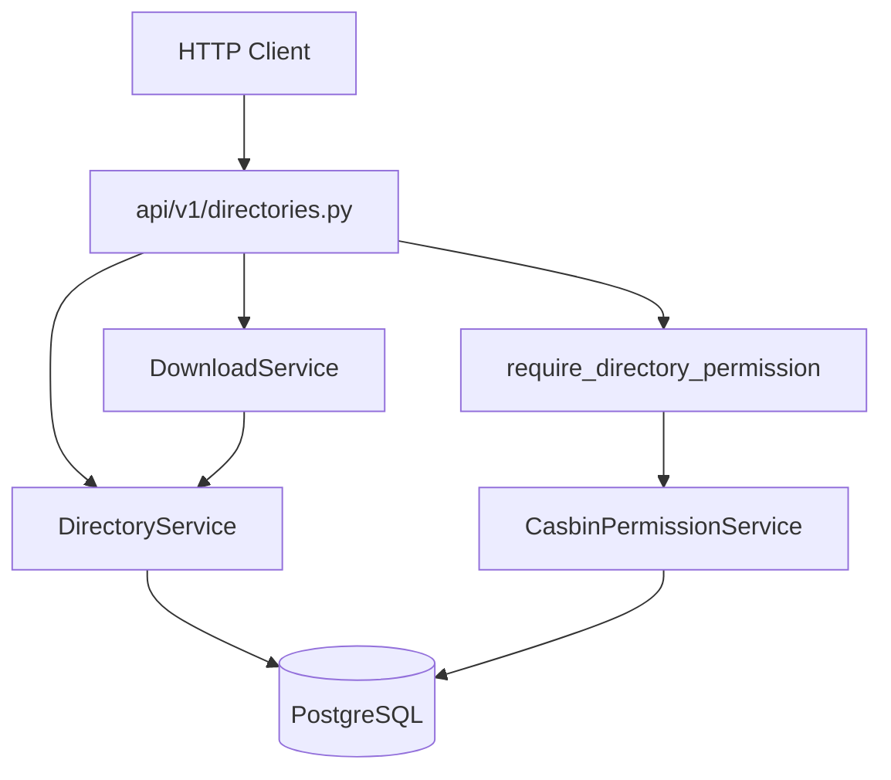
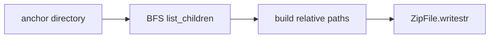

# 06 — Controller–Service Separation (Directory REST API)

> **Audience:** Junior Python developers. Week 6 exposes the Week 5 **directory domain model** over HTTP with Casbin enforcement and a ZIP download utility.

## What We Built

- **`api/v1/directories.py`** — thin REST controllers for tree listing, children, breadcrumbs, CRUD, and ZIP download
- **`DownloadService`** — walks a directory subtree and builds an in-memory ZIP archive
- **Casbin on every route** — `require_directory_permission` (or explicit checks for multi-directory operations like move)
- **HTTP tests** — `tests/test_directories_api.py` (JWT client + Postgres integration)
- **Permission grant validation** — admin grant/revoke now returns `404` when `directory_id` does not exist

Week 5 kept all tree logic in `DirectoryService`; Week 6 adds only HTTP translation and authorization gates.

---

## 1. Thin controllers, fat services

| Layer | File | Responsibility |
|-------|------|----------------|
| Controller | `api/v1/directories.py` | Parse path/body, enforce permissions, map exceptions → HTTP status |
| Service | `services/directory.py` | Tree rules: create, rename, move, delete, queries |
| Service | `services/download.py` | ZIP packaging (no HTTP knowledge) |
| Schema | `schemas/directory.py` | `DirectoryRead`, `DirectoryCreate`, `DirectoryRename`, `DirectoryMove` |
| Deps | `core/deps.py` | `get_directory_service`, `require_directory_permission`, `get_download_service` |

Controllers should read like a table of contents — no SQL, no cycle detection, no ZIP internals.



---

## 2. Endpoint map and permission matrix

| Method | Path | Casbin | Service |
|--------|------|--------|---------|
| `GET` | `/projects/{project_id}/directories/tree` | `READ` on project root | `list_by_project` |
| `GET` | `/directories/{directory_id}/children` | `READ` | `list_children` |
| `GET` | `/directories/{directory_id}/breadcrumbs` | `READ` | `get_breadcrumb_chain` |
| `POST` | `/directories/{directory_id}/children` | `WRITE` on parent (`directory_id`) | `create` |
| `PATCH` | `/directories/{directory_id}` | `WRITE` | `rename` |
| `PATCH` | `/directories/{directory_id}/move` | `WRITE` on source **and** target parent | `move` |
| `DELETE` | `/directories/{directory_id}` | `MANAGE` | `delete` |
| `GET` | `/directories/{directory_id}/download` | `READ` | `DownloadService.build_subtree_zip` |

**Tree listing** resolves the project root first, then checks `READ` on that root. Listing the whole project requires visibility at the tree top.

**Move** checks `WRITE` on both the directory being moved and `new_parent_id`. You need permission to leave the old location and enter the new parent.

Object keys stay `directory:{uuid}` — the same UUID as `directories.id` (Week 4).

---

## 3. Mapping service exceptions to HTTP status

Services raise **domain exceptions**; controllers translate them to **HTTP responses**:

| Service exception | HTTP status | When |
|-------------------|-------------|------|
| `DirectoryNotFoundError` | `404 Not Found` | Unknown `directory_id` or missing project root |
| `DirectoryConflictError` | `409 Conflict` | Duplicate sibling name |
| `DirectoryValidationError` | `400 Bad Request` | Empty name, move cycle, delete/move root |
| Casbin deny | `403 Forbidden` | `require_directory_permission` or manual check |
| Missing Bearer token | `401 Unauthorized` | `get_current_user` |

Pattern in the controller:

```python
try:
    directory = await directory_service.rename(directory_id, name=body.name)
except DirectoryNotFoundError as exc:
    raise HTTPException(status_code=404, detail=str(exc)) from exc
except DirectoryConflictError as exc:
    raise HTTPException(status_code=409, detail=str(exc)) from exc
except DirectoryValidationError as exc:
    raise HTTPException(status_code=400, detail=str(exc)) from exc
```

**Why not raise `HTTPException` inside services?** Services stay reusable from MCP tools, Celery tasks, and tests without importing FastAPI. The controller is the only layer that speaks HTTP.

Pydantic validation (empty `name` in JSON) returns `422` automatically before the handler runs.

---

## 4. How `require_directory_permission` attaches to path params

Week 4 added a **factory** in `core/deps.py`:

```python
def require_directory_permission(permission: DirectoryPermission) -> Callable[..., object]:
    async def _check(
        directory_id: uuid.UUID,  # matched from the route path
        user: Annotated[User, Depends(get_current_user)],
        perm_service: Annotated[CasbinPermissionService, Depends(get_casbin_permission_service)],
    ) -> User:
        allowed = await perm_service.check_directory_permission(user, directory_id, permission)
        if not allowed:
            raise HTTPException(status_code=403, detail=f"Directory {permission.value} permission required")
        return user
    return _check
```

FastAPI resolves dependencies **by parameter name**. If the route declares `directory_id: uuid.UUID` in the path and the dependency also has `directory_id`, FastAPI injects the same value.

Usage:

```python
@router.get("/directories/{directory_id}/children")
async def list_children(
    directory_id: uuid.UUID,
    _user: Annotated[User, Depends(require_directory_permission(DirectoryPermission.READ))],
    directory_service: Annotated[DirectoryService, Depends(get_directory_service)],
) -> list[DirectoryRead]:
    ...
```

The `_user` return value is often unused — the dependency ran for its side effect (403 or pass). `get_current_user` still runs inside the chain, so the route stays authenticated.

**Admin fast path:** `CasbinPermissionService.check_directory_permission` returns `True` immediately when `user.role == admin`.

---

## 5. DownloadService — walking the tree for ZIP output

File: `services/download.py`

KnowledgeNeurons and Commands ship in Weeks 7–10. Week 6 ZIPs export the **folder structure** only (empty directory entries). When neurons exist, this service will add file entries under the same paths.

Algorithm:

1. `require_by_id(directory_id)` — anchor node
2. **Breadth-first walk** from anchor — collect anchor + all descendants (`list_children` per node)
3. Build `id → Directory` map for path reconstruction
4. For each node, walk **up** to the anchor to build a relative path like `Docs/API/`
5. Write each path as a ZIP directory entry (`path/` with trailing slash)
6. Return `(bytes, f"{anchor.name}.zip")`



The controller returns `StreamingResponse` with `Content-Disposition: attachment` and `application/zip`.

---

## 6. Testing routes with JWT

`tests/test_directories_api.py` combines two patterns from earlier weeks:

**From `test_permissions.py` — HTTP client with JWT:**

```python
token, _ = jwt_service.create_access_token(user_id=user.id, email=user.email, role=user.role.value)
async with AsyncClient(
    transport=ASGITransport(app=app),
    base_url="http://test",
    headers={"Authorization": f"Bearer {token}"},
) as client:
    response = await client.get(f"/api/v1/directories/{dir_id}/children")
```

**From `test_directory.py` — real Postgres session:**

```python
@pytest.fixture
async def db_session():
    # engine → connection → transaction → session; rollback after test
```

Override `get_db` to yield the test session (same transaction as seeded projects/directories). Override `get_current_user` to return a test user. Use the **real** `CasbinPermissionService` to `grant_directory_permission` on the project root before calling tree endpoints.

**403 test:** call an endpoint without granting permission — expect `403`.

**curl (manual):**

```bash
# After Google login, copy access token from SPA fragment
TOKEN="eyJ..."
PROJECT_ID="..."
ROOT_ID="..."

curl -s -H "Authorization: Bearer $TOKEN" \
  "http://localhost:8000/api/v1/projects/$PROJECT_ID/directories/tree" | jq

curl -s -X POST -H "Authorization: Bearer $TOKEN" -H "Content-Type: application/json" \
  -d '{"name":"Docs"}' \
  "http://localhost:8000/api/v1/directories/$ROOT_ID/children"

curl -s -o tree.zip -H "Authorization: Bearer $TOKEN" \
  "http://localhost:8000/api/v1/directories/$ROOT_ID/download"
```

---

## 7. File map

| File | Role |
|------|------|
| `api/v1/directories.py` | REST controllers |
| `api/v1/router.py` | Registers directories router |
| `services/download.py` | Subtree ZIP builder |
| `services/directory.py` | Domain logic (Week 5) |
| `core/deps.py` | `get_download_service`, permission factories |
| `tests/test_directories_api.py` | Route + permission integration tests |
| `tests/test_directory.py` | Service-layer tests (Week 5, unchanged) |

---

## Local setup

```bash
cd api
docker compose up -d
uv run alembic upgrade head
uv run uvicorn knowledge_ai.main:app --reload --port 8000
```

Grant yourself `READ` on a project's root (admin), or promote to `admin` and re-login:

```bash
# Admin: grant READ to a user on root directory
curl -X POST -H "Authorization: Bearer $ADMIN_TOKEN" \
  -H "Content-Type: application/json" \
  -d '{"user_id":"<user-uuid>","permission":"READ"}' \
  "http://localhost:8000/api/v1/permissions/directories/<root-id>"
```

---

## Code Walkthrough

1. **`api/v1/directories.py`** — Exception mapping, `require_directory_permission` on reads/writes, dual WRITE check on move.
2. **`services/download.py`** — BFS subtree collection and ZIP path building.
3. **`tests/test_directories_api.py`** — `get_db` override + Casbin grant + authenticated httpx client.

---

## Further Reading

- [FastAPI Response classes](https://fastapi.tiangolo.com/advanced/custom-response/) — `StreamingResponse` for file downloads
- [Python zipfile](https://docs.python.org/3/library/zipfile.html) — in-memory archives with `BytesIO`
- Week 5 doc: `05-hierarchical-data-trees.md` — adjacency list and `DirectoryService`
- Week 4 doc: `04-rbac-with-casbin.md` — permission hierarchy (`MANAGE` ⊃ `WRITE` ⊃ `READ`)

---

## Exercises (Optional)

1. Add `list_descendants` to `DirectoryService` with a recursive CTE and use it in `DownloadService`.
2. Return `ETag` / `If-None-Match` on tree listing for SPA cache invalidation (Week 17).
