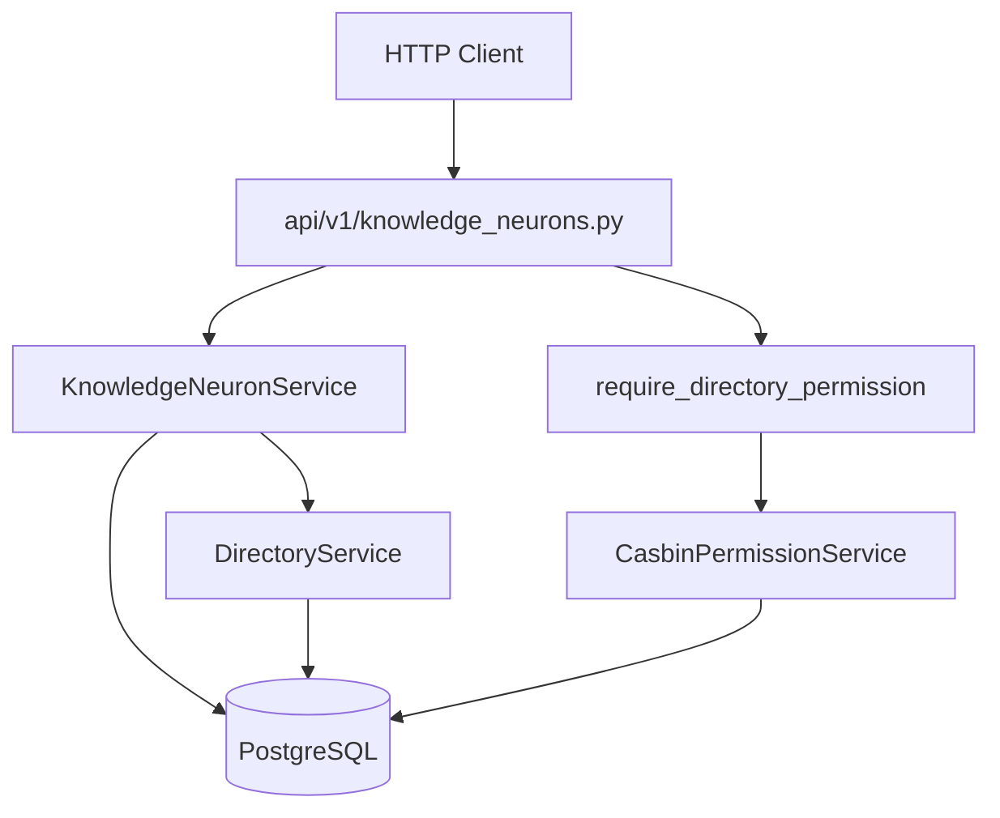

# 07 — Domain Modeling Patterns (KnowledgeNeuron CRUD)

> **Audience:** Junior Python developers learning AI engineering. Week 7 introduces **KnowledgeNeuron** — the stored knowledge document that later gets embedded and searched semantically.

## What We Built

- **`models/knowledge_neuron.py`** — `knowledge_neurons` table: `title`, `content`, `directory_id`, `metadata` (JSONB)
- **`services/knowledge_neuron.py`** — `KnowledgeNeuronService`: create, read, update, delete, list by directory
- **`schemas/knowledge_neuron.py`** — Pydantic DTOs for API request/response
- **`api/v1/knowledge_neurons.py`** — thin REST controllers with Casbin directory permission checks
- **Alembic migration** — `20260620_0001_add_knowledge_neurons_table`
- **Tests** — `tests/test_knowledge_neuron.py` (service) + `tests/test_knowledge_neurons_api.py` (HTTP)

Week 7 deliberately has **no embeddings yet**. We validate CRUD, ownership scoping, and permissions before adding AI infrastructure in Weeks 8–9.

---

## 1. What is a KnowledgeNeuron?

A **KnowledgeNeuron** is a stored knowledge document — a title plus body text — that lives inside a **directory folder** in your project tree.

| Field | Purpose |
|-------|---------|
| `title` | Short label shown in UI and included in embedding text |
| `content` | The actual knowledge (markdown, notes, runbooks, etc.) |
| `directory_id` | Which folder owns this neuron (FK → `directories`) |
| `metadata` | Flexible JSON (tags, source URL, author notes) without schema migrations |

This is **not** the MCP output. Agents receive a **StratumContext** (Week 14) — a layered tree built from many neurons and commands. A KnowledgeNeuron is one leaf document.

---

## 2. Text → numbers (preview for Week 8)

Computers cannot compare *meaning* directly. They compare **numbers**.

An **embedding** is a fixed-length list of floats (a **vector**) that represents the semantic content of text. Similar meanings → vectors that are close together in high-dimensional space.

Think of it like GPS coordinates for ideas:

- "error handling" and "exception catching" might land near each other
- "error handling" and "database migrations" would be far apart

Week 7 stores plain text. Week 8 converts that text to vectors via Voyage AI and stores them in PostgreSQL. Week 9 searches by vector similarity.

We build CRUD first so you always have a reliable document layer underneath the AI layer.

---

## 3. Ownership scoping: neurons live in directories

Every KnowledgeNeuron belongs to exactly one directory. Permissions are checked on the **parent directory**, not on the neuron id itself — same pattern as Week 6.

| Action | Route | Casbin permission on parent directory |
|--------|-------|--------------------------------------|
| List | `GET /directories/{directory_id}/knowledge-neurons` | `READ` |
| Get one | `GET /knowledge-neurons/{neuron_id}` | `READ` on neuron's directory |
| Create | `POST /directories/{directory_id}/knowledge-neurons` | `WRITE` |
| Update | `PATCH /knowledge-neurons/{neuron_id}` | `WRITE` on neuron's directory |
| Delete | `DELETE /knowledge-neurons/{neuron_id}` | `MANAGE` on neuron's directory |

For routes keyed by `neuron_id`, the controller loads the neuron, reads `directory_id`, then calls `check_directory_permission`.

---

## 4. Controller–service separation (same pattern as Week 6)



| Layer | Responsibility |
|-------|----------------|
| Controller | HTTP status codes, permission gates, DTO mapping |
| Service | Validation, SQLAlchemy CRUD, domain exceptions |
| Schema | Pydantic models — API contract separate from ORM |

Domain exceptions map to HTTP like Week 6:

| Service exception | HTTP status |
|-------------------|-------------|
| `KnowledgeNeuronNotFoundError` | `404 Not Found` |
| `KnowledgeNeuronValidationError` | `400 Bad Request` |

---

## 5. Metadata as JSONB

Structured columns (e.g. separate `tags` table) are rigid. **JSONB** lets clients attach arbitrary key/value metadata without migrations:

```json
{"tags": ["python", "errors"], "source": "internal-wiki"}
```

In SQLAlchemy, the Python attribute is `metadata_json` mapped to column name `metadata` (because `metadata` is reserved on the ORM class).

---

## 6. Code walkthrough

**Create flow:**

1. `POST /directories/{directory_id}/knowledge-neurons` — `require_directory_permission(WRITE)` on path `directory_id`
2. `KnowledgeNeuronService.create()` — validates title/content, confirms directory exists via `DirectoryService.require_by_id`
3. Row inserted; response is `KnowledgeNeuronRead`

**Get-by-id flow:**

1. `GET /knowledge-neurons/{neuron_id}`
2. `_require_neuron_directory_permission` loads neuron → checks `READ` on `neuron.directory_id`

---

## Further Reading

- [PostgreSQL JSONB](https://www.postgresql.org/docs/current/datatype-json.html)
- [FastAPI Dependencies](https://fastapi.tiangolo.com/tutorial/dependencies/)
- [Voyage AI embeddings overview](https://docs.voyageai.com/docs/embeddings) — preview for Week 8

---

## Exercises (Optional)

1. Add a `GET /directories/{directory_id}/knowledge-neurons/count` endpoint that returns `{ "count": N }` with `READ` permission.
2. Extend `metadata` validation with a Pydantic model for known keys (`tags: list[str]`) while still allowing extra fields.
