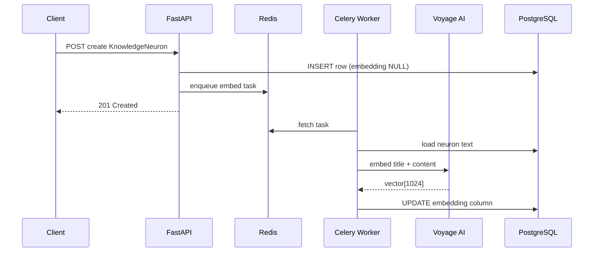
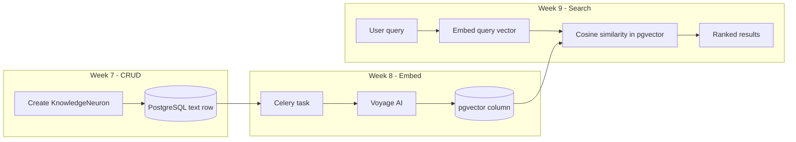

# 08 — Embeddings and Celery Background Tasks

> **Audience:** Junior Python developers learning AI engineering. Week 8 adds the **embedding pipeline**: convert KnowledgeNeuron text to vectors via Voyage AI, store them in PostgreSQL pgvector, and process work asynchronously with Celery + Redis.

## What We Built

- **`services/embedding.py`** — `EmbeddingService` + Voyage AI client (`voyage-code-3`) via httpx
- **`core/celery_app.py`** — Celery app configured with Redis broker
- **`tasks/embedding.py`** — `embed_knowledge_neuron(neuron_id)` background task
- **pgvector column** — `knowledge_neurons.embedding vector(1024)` via Alembic `20260620_0002`
- **Auto-trigger** — create/update enqueues embed task; delete removes the row (embedding goes with it)
- **Settings** — `VOYAGE_API_KEY`, `VOYAGE_MODEL`, `VOYAGE_EMBEDDING_DIMENSIONS` in `.env.example`

---

## 1. Text → numbers (embeddings)

When you read "error handling," you understand it means catching and responding to failures in code. A search engine doing **keyword matching** only finds documents containing those exact words.

An **embedding model** (here: Voyage AI `voyage-code-3`) reads text and outputs a **vector**: a fixed-length array of floats. For `voyage-code-3`, that length is **1024 dimensions**.

Each dimension is a number capturing some aspect of meaning learned during model training. You do not interpret individual dimensions by hand — you use **distance between vectors** to measure semantic similarity.

**Analogy:** GPS coordinates place locations on a map. Embedding coordinates place *ideas* in a high-dimensional "meaning space." Nearby coordinates ≈ similar meaning.

---

## 2. Vectors and pgvector storage

A **vector** in this context is simply:

```python
[0.012, -0.034, 0.891, ...]  # 1024 floats for voyage-code-3
```

We store it in PostgreSQL using the **pgvector** extension:

```sql
ALTER TABLE knowledge_neurons ADD COLUMN embedding vector(1024);
```

Why PostgreSQL instead of a separate vector database?

- You already have neurons, directories, and Casbin policies in Postgres
- Joins and permission filters stay in one database
- pgvector adds efficient similarity operators (`<=>` cosine distance)

---

## 3. Why Celery? (async task queue)

Embedding calls Voyage AI over the network. That takes hundreds of milliseconds to seconds — too slow to block an HTTP response.

**Celery** is a distributed task queue:

1. API saves the KnowledgeNeuron and returns `201 Created` immediately
2. API enqueues `embed_knowledge_neuron.delay(neuron_id)` to Redis
3. A **Celery worker** process picks up the task, calls Voyage, writes the vector to Postgres



**Idempotency:** Re-running embed on the same neuron overwrites the vector — safe after content edits.

---

## 4. What text gets embedded?

```python
embed_text = f"{neuron.title}\n\n{neuron.content}"
```

The title carries semantic signal ("Error Handling") even when content is long. Concatenating both gives the model full context.

Voyage accepts an `input_type`:

- `"document"` — for stored knowledge (create/update pipeline)
- `"query"` — for search queries (Week 9)

Using the correct input type improves retrieval quality.

---

## 5. End-to-end flow (Weeks 7–9 preview)



---

## 6. Running the worker locally

Terminal 1 — API (already running):

```bash
cd api
uv run uvicorn knowledge_ai.main:app --reload --port 8000
```

Terminal 2 — Celery worker:

```bash
cd api
uv run celery -A knowledge_ai.core.celery_app worker --loglevel=info -Q embeddings
```

Ensure Docker Compose Postgres + Redis are up and migrations are at head:

```bash
docker compose up -d
uv run alembic upgrade head
```

Set `VOYAGE_API_KEY` in `.env`.

---

## 7. Code walkthrough

| File | Role |
|------|------|
| `services/embedding.py` | `embed_texts()`, `embed_knowledge_neuron()` — httpx POST to Voyage |
| `tasks/embedding.py` | Sync Celery entrypoint → `asyncio.run()` with async SQLAlchemy session |
| `services/knowledge_neuron.py` | `_enqueue_embed()` after create/update |
| `core/celery_app.py` | Broker URL from `REDIS_URL` |

---

## Further Reading

- [Voyage AI Embeddings API](https://docs.voyageai.com/reference/embeddings-api)
- [Celery First Steps](https://docs.celeryq.dev/en/stable/getting-started/first-steps-with-celery.html)
- [pgvector GitHub](https://github.com/pgvector/pgvector)

---

## Exercises (Optional)

1. Add a `has_embedding` poll endpoint or expose embedding status in list responses (already on `KnowledgeNeuronRead`).
2. Log Celery task duration and vector dimension count for observability practice.
