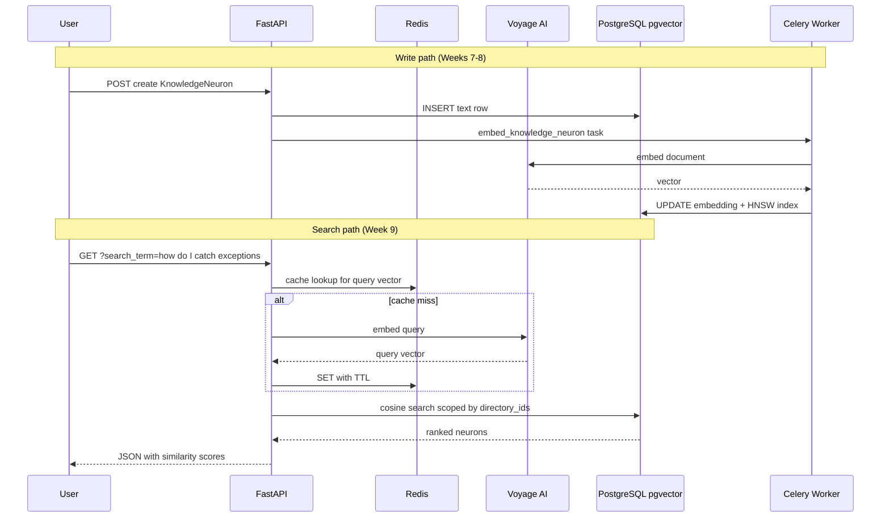

# 09 — Vector Search with pgvector

> **Audience:** Junior Python developers learning AI engineering. Week 9 completes Phase 4: **semantic search** over KnowledgeNeurons using pgvector cosine similarity, permission scoping, and Redis query-embedding cache.

## What We Built

- **HNSW index** — `ix_knowledge_neurons_embedding_hnsw` for fast approximate nearest-neighbor search (Alembic `20260620_0003`)
- **`EmbeddingService.search()`** — embed query → pgvector cosine rank → top-k results
- **`GET /api/v1/knowledge-neurons?search_term=...`** — REST semantic search scoped to directories the user can `READ`
- **Redis query cache** — caches query embedding vectors (5-minute TTL) to reduce Voyage API calls
- **Tests** — `tests/test_embedding.py` + search route in `tests/test_knowledge_neurons_api.py`

**Milestone:** Create a KnowledgeNeuron → Celery embeds it → semantic search returns relevant results.

---

## 1. Semantic search vs keyword search

| Approach | Query | Matches document about... |
|----------|-------|---------------------------|
| **Keyword** | `"error handling"` | Only docs containing those exact words |
| **Semantic** | `"how do I catch exceptions?"` | Docs about try/except, raise, etc. — even without those exact words |

Keyword search (SQL `ILIKE`, Elasticsearch term match) fails when users phrase questions differently from how docs were written.

Semantic search embeds the **query** and **documents** into the same vector space, then finds documents whose vectors are **closest** to the query vector — approximating "meaning similarity."

This matters for knowledge bases queried by humans and coding agents in natural language.

---

## 2. Cosine similarity and distance

Two vectors can be compared using **cosine similarity** — essentially the angle between them (ignoring magnitude):

- **Similarity = 1.0** — same direction (very related meaning)
- **Similarity = 0.0** — orthogonal (unrelated)
- **Similarity negative** — opposing directions (rare in practice for text embeddings)

pgvector exposes the **cosine distance** operator `<=>`:

- Distance 0 = identical direction
- Larger distance = less similar

We report **similarity = 1 - distance** in API responses so higher numbers feel intuitive.

```sql
ORDER BY kn.embedding <=> query_vector
LIMIT 10
```

---

## 3. HNSW index — fast search at scale

Exact nearest-neighbor search compares the query to **every** stored vector. That is O(n) — fine for hundreds of rows, slow for millions.

**HNSW** (Hierarchical Navigable Small World) is an **approximate** nearest-neighbor index:

- Builds a multi-layer graph of vector neighbors
- Traverses the graph to find *likely* nearest neighbors quickly
- Trades a tiny amount of recall for large speed gains

Our migration:

```sql
CREATE INDEX ix_knowledge_neurons_embedding_hnsw
ON knowledge_neurons
USING hnsw (embedding vector_cosine_ops)
WHERE embedding IS NOT NULL;
```

The partial index (`WHERE embedding IS NOT NULL`) skips rows not yet embedded by Celery.

---

## 4. Permission-scoped search

Search must not leak neurons from directories the user cannot read.

Flow:

1. Authenticate user (`get_current_user`)
2. `CasbinPermissionService.get_readable_directory_ids(user)`:
   - Admin → `None` (search all directories)
   - Regular user → list of directory UUIDs with explicit grants
3. SQL filters: `directory_id = ANY(allowed_ids)`
4. Only neurons with non-null embeddings participate

Casbin checks remain **per directory object** — same model as Week 6 list endpoints.

---

## 5. Redis query-embedding cache

Every search embeds the query via Voyage AI. Repeated identical queries (or agent tool loops) would waste API calls and latency.

Cache key pattern:

```
embedding:query:{model}:{sha256(normalized_query)}
```

TTL: **300 seconds** (5 minutes) — long enough to help repeated searches, short enough that model/key changes do not stale forever.

Week 22 reuses the same Redis instance for rate limits and token blacklist.

---

## 6. End-to-end flow (complete Phase 4)



---

## 7. API usage

```http
GET /api/v1/knowledge-neurons?search_term=how%20do%20I%20catch%20exceptions&limit=10
Authorization: Bearer <access_token>
```

Response:

```json
[
  {
    "id": "...",
    "directory_id": "...",
    "title": "Error Handling",
    "content": "Use try/except for recoverable failures.",
    "metadata": {"tags": ["python"]},
    "similarity": 0.87
  }
]
```

Neurons without embeddings (Celery still processing) are excluded until `embedding IS NOT NULL`.

---

## 8. Code walkthrough

| File | Role |
|------|------|
| `services/embedding.py` | `embed_query()`, `search()` — cache + raw SQL cosine query |
| `services/casbin_permission.py` | `get_readable_directory_ids()` |
| `api/v1/knowledge_neurons.py` | `search_knowledge_neurons` route |
| `core/redis.py` | Async Redis client for query cache |

---

## Further Reading

- [pgvector: Distance Functions](https://github.com/pgvector/pgvector#distance-functions)
- [pgvector: HNSW Indexes](https://github.com/pgvector/pgvector#hnsw)
- [Voyage AI: Retrieval guidance](https://docs.voyageai.com/docs/embeddings)

---

## Exercises (Optional)

1. Add optional `directory_id` query param to restrict search to one subtree (still require `READ`).
2. Return `has_embedding: false` neurons in a separate "pending index" admin view.
