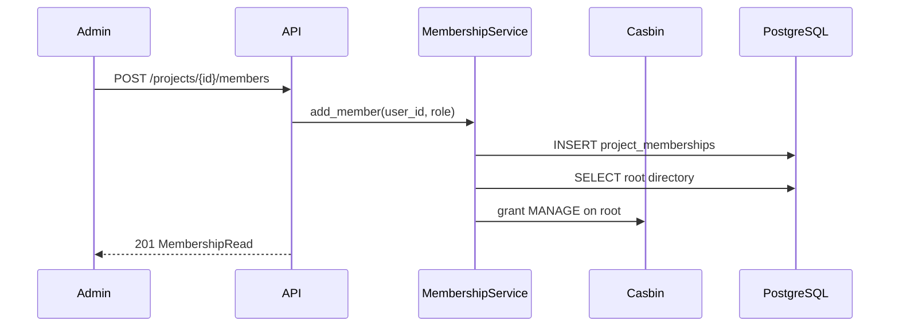

# 11 — Multi-Tenant Project Scoping

> **Audience:** Junior Python developers learning AI engineering. Week 11 completes the REST API surface with **projects**, **membership**, **user admin**, and **account** endpoints — the multi-tenant layer that sits above directories, neurons, and commands.

## What We Built

- **`services/project.py`** — extended CRUD, archive/unarchive, delete
- **`services/membership.py`** — add/remove members, roles, `is_context_exposed` toggle
- **`services/user.py`** — admin `update` for role and active status
- **`api/v1/projects.py`** — project + membership REST routes
- **`api/v1/account.py`** — `GET /account`, `PATCH /account/projects/{id}`
- **`api/v1/admin.py`** — extended `PATCH /admin/users/{id}`
- **Alembic** — `20260704_0002_add_is_context_exposed_to_memberships`
- **Tests** — `tests/test_project_membership.py`, `tests/test_projects_api.py`

---

## 1. Multi-tenancy: projects isolate data

A **project** is the top-level boundary for all knowledge:

```
Project
 └── Root (directory)
      ├── Docs/
      │    └── KnowledgeNeurons, Commands
      └── Scripts/
           └── Commands
```

Every directory, neuron, and command belongs to exactly one project (via the directory tree). Users never see "all data in the database" — they see **projects they belong to**.

| Layer | What it scopes |
|-------|----------------|
| **Project** | Data isolation — separate trees per team/client |
| **ProjectMembership** | Who belongs to which project |
| **Directory + Casbin** | What each user can do inside a project tree |

This is **multi-tenancy**: one application, many isolated workspaces. PostgreSQL stores everything in shared tables; isolation is enforced in the service and API layers via membership and Casbin checks.

---

## 2. Two role systems: admin vs project owner

Knowledge-AI uses **two independent role concepts**:

| Role type | Stored in | Values | Scope |
|-----------|-----------|--------|-------|
| **Application role** | `users.role` | `admin`, `user` | Whole app — create projects, manage all users |
| **Project role** | `project_memberships.role` | `owner`, `member` | One project — manage members, update project metadata |

**Admin (`users.role = admin`):**
- Bypasses directory permission checks (Casbin fast path)
- Can create/archive/delete any project
- Can list and update all users
- Does not need project membership to access a project

**Project owner (`project_memberships.role = owner`):**
- Can add/remove members on their project
- Can PATCH project name/description
- Still needs Casbin directory grants for tree operations (auto-granted MANAGE on root when added as member)

**Project member (`project_memberships.role = member`):**
- Can read project metadata if they are a member
- Directory access comes from Casbin grants (MANAGE on root when added via `MembershipService`)

Keep these separate in your head: **admin is global; owner/member is per-project.**

---

## 3. Membership → Casbin: auto-grant on add

When `MembershipService.add_member` runs:

1. Insert `project_memberships` row
2. Find the project's **root directory** (`parent_id IS NULL`)
3. `grant_directory_permission(user_id, root_id, MANAGE)` via Casbin

This gives new members full tree control under that project without an admin manually granting each folder.

On `remove_member`, we **revoke MANAGE on the root**. Other directory grants the user received separately are left intact (admin may have granted subfolder READ only).



---

## 4. `is_context_exposed`: user-controlled MCP visibility

Column: `project_memberships.is_context_exposed` (boolean, default `false`)

**What it means:** When the user connects an MCP coding agent (Week 12+), the agent calls `get_project_context` (Week 14). Only projects where **this user** set `is_context_exposed = true` are included in the **ProjectContext** payload.

**Why on membership, not project:** Exposure is a **per-user choice**. Two members of the same project might disagree on whether agents should see it. The flag lives on the row that links user ↔ project.

**Account API:**
- `GET /api/v1/account` — list my projects with `membership_role` and `is_context_exposed`
- `PATCH /api/v1/account/projects/{project_id}` — toggle exposure (must be a member)

---

## 5. Endpoint map

| Area | Route | Auth |
|------|-------|------|
| List/create projects | `GET/POST /projects` | Member list / admin create |
| Project detail | `GET/PATCH/DELETE /projects/{id}` | Member read / owner+admin patch / admin delete |
| Archive | `POST /projects/{id}/archive`, `.../unarchive` | Admin |
| Members | `GET/POST /projects/{id}/members`, `DELETE .../members/{user_id}` | Member list / owner+admin mutate |
| Users | `GET/PATCH /admin/users` | Admin |
| Account | `GET /account`, `PATCH /account/projects/{id}` | Authenticated member |

---

## 6. Code walkthrough

**`require_project_member` / `require_project_owner_or_admin`** (`core/deps.py`):

- Fast path: `user.role == ADMIN` → allow
- Otherwise: query `MembershipService.get_membership` or `is_owner`

**`ProjectService.create`** (unchanged hook from Week 5):

- Creates project row → `DirectoryService.create_root_for_project` → `"Root"` folder exists before any member is added

**Admin user update** (`api/v1/admin.py`):

- After `UserService.update`, if `role` changed → `CasbinPermissionService.sync_user_role` so Casbin grouping policies match `users.role`

---

## 7. Further reading

- [Multi-tenant data modeling](https://www.citusdata.com/blog/2016/08/30/multi-tenant-sharding-guide/) — shared schema vs separate DBs
- Week 4 doc: `04-rbac-with-casbin.md` — directory permissions
- Week 5 doc: `05-hierarchical-data-trees.md` — project root hook

---

## Exercises (Optional)

1. On project create, auto-add the creating admin as `owner` membership.
2. Add `GET /projects/{id}/members/me` returning the caller's membership row.
3. Sketch how `ContextBuilder` (Week 14) will filter projects: `membership.is_context_exposed AND Casbin READ on root`.
