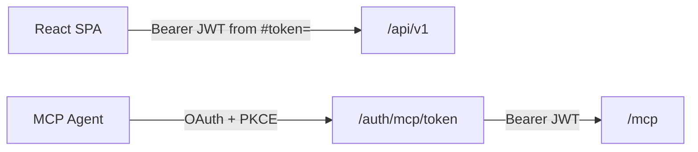
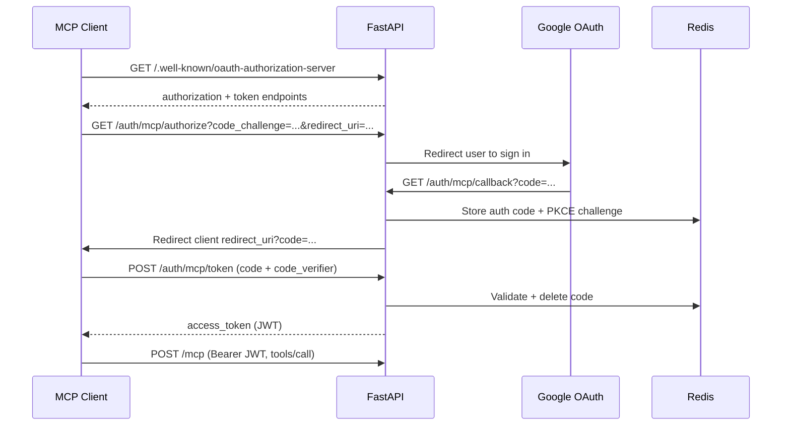

# 12 — MCP Server, OAuth Discovery & PKCE Agent Auth

> **Audience:** Junior Python developers learning AI engineering. Week 12 adds a second client path: coding agents connect over MCP with OAuth + PKCE, while the React SPA keeps its existing JWT fragment flow.

## What We Built

- **`mcp[cli]`** dependency and a **FastMCP** server mounted at **`/mcp`** (Streamable HTTP)
- **stdio transport** entry point: `python -m knowledge_ai.mcp.stdio` for local agent testing
- **`/.well-known/oauth-authorization-server`** and **`/.well-known/oauth-protected-resource`** discovery endpoints
- **`PKCEService`** — S256 code verifier/challenge generation and verification
- **`OAuthFlowService`** extensions for the MCP authorization-code + PKCE path (separate from SPA `#token=` handoff)
- **`MCPAuthMiddleware`** — validates Bearer JWT **only** on `/mcp` routes
- MCP OAuth controllers: `GET /api/v1/auth/mcp/authorize`, `callback`, `POST /api/v1/auth/mcp/token`

---

## 1. What is MCP (Model Context Protocol)?

**MCP** is a standard way for AI applications (like Cursor, Claude Code, or custom agents) to call **tools** on a remote server. Instead of copying your entire knowledge base into the model prompt, the agent:

1. Connects to an MCP server
2. Lists available tools (`search_knowledge_neurons`, `get_project_context`, …)
3. Invokes a tool when it needs data
4. Receives structured JSON back

### Transports

| Transport | Use case | Auth in Knowledge-AI |
|-----------|----------|----------------------|
| **Streamable HTTP** | Production agents hit `https://api.example.com/mcp` | `MCPAuthMiddleware` + Bearer JWT |
| **stdio** | Local dev: agent subprocess talks over stdin/stdout | Optional `MCP_STDIO_USER_ID` env var (no HTTP middleware) |

The Python SDK wraps tools with `@mcp_server.tool()` and exposes an ASGI app via `streamable_http_app()`, which we **mount** on the existing FastAPI app.

---

## 2. Dual auth paths — why route-scoped middleware?



| Path | Client | How tokens arrive |
|------|--------|-------------------|
| **SPA** | Browser | Google OAuth → callback → `#token=` fragment + refresh cookie |
| **MCP** | Coding agent | Discovery → PKCE authorize → token endpoint → Bearer on `/mcp` |

**Critical rule:** REST routes use `Depends(get_current_user)` per endpoint. We **never** add global JWT middleware on the whole app — that would break unauthenticated health checks and the OAuth redirect dance.

`MCPAuthMiddleware` checks `request.url.path.startswith("/mcp")` and returns `401` without a valid Bearer token. Everything under `/api/v1` is unchanged.

---

## 3. OAuth discovery — what `/.well-known/*` provides

MCP clients do not hard-code your login URLs. They fetch **RFC 8414** metadata:

```
GET /.well-known/oauth-authorization-server
```

Response (simplified):

```json
{
  "issuer": "http://localhost:8000",
  "authorization_endpoint": "http://localhost:8000/api/v1/auth/mcp/authorize",
  "token_endpoint": "http://localhost:8000/api/v1/auth/mcp/token",
  "code_challenge_methods_supported": ["S256"]
}
```

**RFC 9728** protected-resource metadata at `/.well-known/oauth-protected-resource` tells the client that `/mcp` is the resource and which authorization server protects it.

---

## 4. PKCE — why agents skip the client secret

Public clients (desktop agents, CLI tools) **cannot** store a `client_secret` safely. **PKCE** (Proof Key for Code Exchange) replaces the secret:

1. Agent generates random **code_verifier**
2. Sends **code_challenge** = `BASE64URL(SHA256(verifier))` to `/authorize`
3. After Google login, agent receives a one-time **authorization code**
4. Agent posts `code` + **code_verifier** to `/token`
5. Server verifies `SHA256(verifier) == stored challenge`, then issues JWT

`PKCEService` in `services/pkce.py` implements S256. Authorization codes live in **Redis** with a short TTL (single-use via `GETDEL`).

---

## Code Walkthrough

| File | Role |
|------|------|
| `services/pkce.py` | Verifier/challenge helpers |
| `services/oauth_flow.py` | `build_mcp_authorize_redirect`, `handle_mcp_callback`, `exchange_mcp_authorization_code` |
| `api/well_known.py` | Discovery JSON |
| `api/v1/mcp_auth.py` | Authorize, callback, token HTTP handlers |
| `middleware/mcp_auth.py` | Bearer JWT gate for `/mcp` |
| `mcp/server.py` | FastMCP tool registration (filled out Weeks 13–14) |
| `main.py` | Mount `/mcp`, register middleware, MCP session manager lifespan |

### MCP agent login sequence



---

## Local testing

```bash
cd api
docker compose up -d
uv run uvicorn knowledge_ai.main:app --reload --port 8000

# Stdio transport (separate terminal)
uv run python -m knowledge_ai.mcp.stdio
```

Register **both** Google redirect URIs in Google Cloud Console:

- `http://localhost:8000/api/v1/auth/google/callback` (SPA)
- `http://localhost:8000/api/v1/auth/mcp/callback` (MCP)

---

## Further Reading

- [Model Context Protocol specification](https://modelcontextprotocol.io/)
- [MCP Python SDK](https://github.com/modelcontextprotocol/python-sdk)
- [RFC 7636 — PKCE](https://datatracker.ietf.org/doc/html/rfc7636)
- [RFC 8414 — OAuth Authorization Server Metadata](https://datatracker.ietf.org/doc/html/rfc8414)

---

## Exercises (Optional)

1. Add `refresh_token` grant support on `/auth/mcp/token` for long-lived agent sessions.
2. Log MCP tool invocations with the authenticated user id for audit trails.
