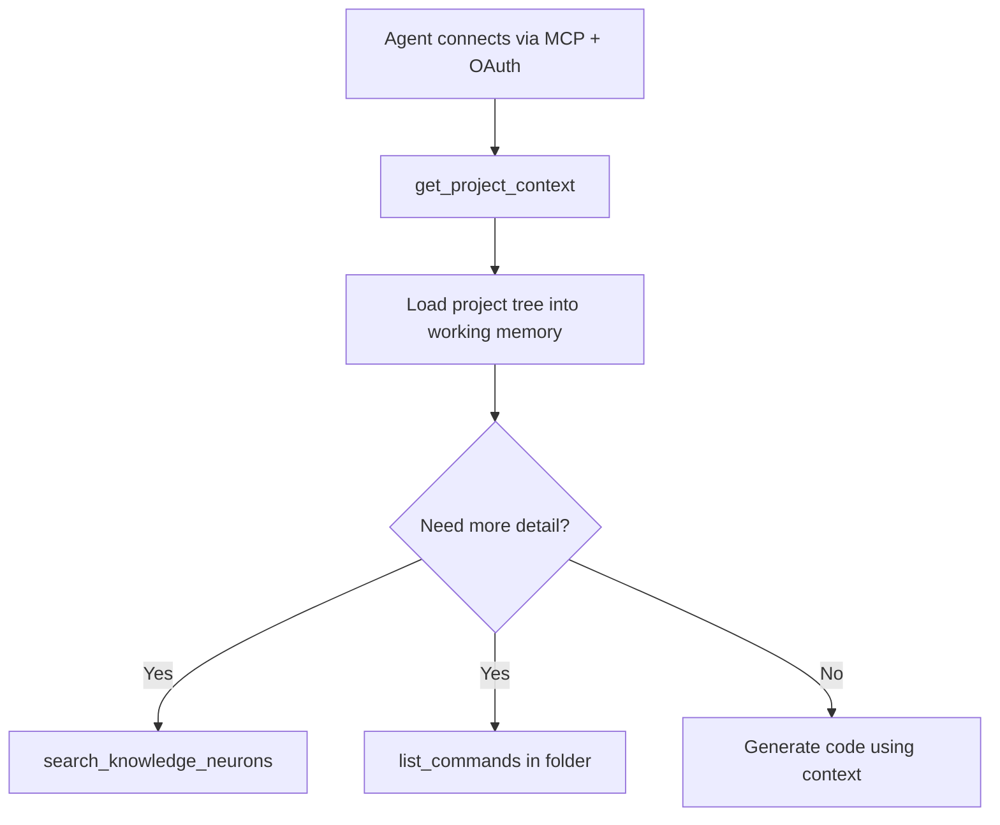

# 14 — ProjectContext for Coding Agents

> **Audience:** Junior Python developers. Week 14 delivers the flagship MCP tool: a layered directory tree of KnowledgeNeurons and Commands for projects the user chose to expose.

## What We Built

- **`ContextBuilder`** service — walks exposed project directory trees and aggregates neurons + commands
- **`ProjectContext`** Pydantic schema (`schemas/project_context.py`)
- MCP tool **`get_project_context`** — returns JSON for all projects where `project_memberships.is_context_exposed = true`
- **stdio integration test** — local MCP client lists tools over stdin/stdout
- Tests: `tests/test_context_builder.py`, `tests/test_mcp_stdio.py`

---

## 1. ProjectContext — not a single neuron

A **KnowledgeNeuron** is one document (title + content). Agents doing project-wide work need **structure**: which folder contains deployment notes, which holds CLI commands, etc.

**ProjectContext** is the MCP aggregate payload:

```text
ProjectContext
└── projects[]
    └── ProjectTree
        ├── project_id, project_name
        └── root: ProjectDirectoryNode
            ├── children[] (nested folders)
            ├── knowledge_neurons[] (leaves)
            └── commands[] (leaves)
```

The name matches the tool `get_project_context`: scoped knowledge for one or more exposed projects.

---

## 2. ContextBuilder — how the tree is assembled

`ContextBuilder.build_for_user(user)`:

1. `MembershipService.list_projects_for_user` → filter `is_context_exposed == true`
2. For each project: `DirectoryService.list_by_project` → full adjacency list
3. Load all neurons and commands in those directories (single query each)
4. Recursively build `ProjectDirectoryNode` from the root directory

No embeddings or vector search — this is a **deterministic snapshot** of stored content, controlled by the user's exposure toggle (Week 11).

---

## 3. `is_context_exposed` — user-controlled filter

From the Account page (Week 15 UI; API exists now):

```
PATCH /api/v1/account/projects/{id}
{ "is_context_exposed": true }
```

**Per user, per project.** Two teammates on the same project can expose different subsets to their own agents. `get_project_context` only includes projects **the authenticated user** exposed.

---

## 4. Agent consumption — using ProjectContext in a session

Typical coding-agent workflow:



1. **Bootstrap:** `get_project_context` gives the agent your project's folder layout, key neurons, and reusable commands.
2. **Drill down:** `search_knowledge_neurons("error handling async pg")` finds specific neurons not obvious from titles alone.
3. **Commands:** `list_commands(directory_id=...)` when the agent needs runnable snippets from a folder.

Keep ProjectContext as the **map**; use search for **needle** queries.

---

## Schema snapshot

```python
class ProjectDirectoryNode(BaseModel):
    id: UUID
    name: str
    children: list[ProjectDirectoryNode]
    knowledge_neurons: list[ProjectNeuronSummary]
    commands: list[ProjectCommandSummary]
```

Full definitions: `schemas/project_context.py`.

---

## Code Walkthrough

| File | Role |
|------|------|
| `services/context_builder.py` | Tree assembly from DB |
| `schemas/project_context.py` | MCP-facing DTOs |
| `mcp/server.py` | `get_project_context` tool → `ContextBuilder.build_for_user` |
| `services/membership.py` | `is_context_exposed` source of truth |

---

## Stdio integration test

```bash
uv run pytest tests/test_mcp_stdio.py -v
```

Spawns `python -m knowledge_ai.mcp.stdio` and uses the MCP Python client to call `list_tools`. This validates the stdio transport without HTTP auth — useful for local tool development.

For HTTP testing with auth, use the MCP OAuth flow from Week 12, then:

```bash
curl -H "Authorization: Bearer $TOKEN" \
  -H "Accept: application/json" \
  -d '{"jsonrpc":"2.0","id":1,"method":"tools/call","params":{"name":"get_project_context","arguments":{}}}' \
  http://localhost:8000/mcp
```

---

## Further Reading

- [Week 11 — Multi-tenant scoping](./11-multi-tenant-project-scoping.md)
- [Week 05 — Hierarchical trees](./05-hierarchical-data-trees.md)

---

## Exercises (Optional)

1. Add `max_depth` to limit how deep `ContextBuilder` walks for very large projects.
2. Include `has_embedding` flags on neuron summaries so agents know which entries are searchable.
