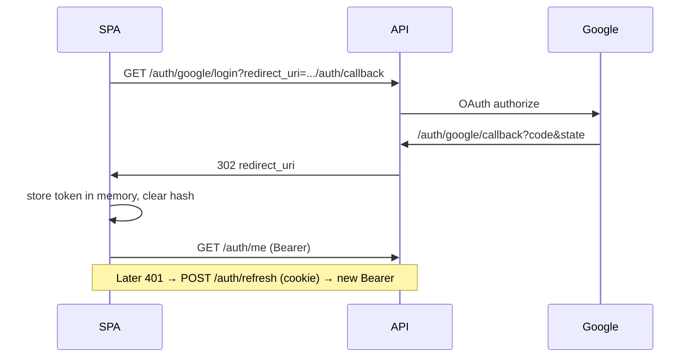

# 02 — SPA Auth Patterns

## What We Built

Week 16 wires Google OAuth into the SPA: `/login` redirects to `GET /api/v1/auth/google/login`, `/auth/callback` reads `#token=` from the URL fragment, Axios attaches `Authorization: Bearer …` and refreshes on 401 via `POST /api/v1/auth/refresh` (httpOnly cookie), and `ProtectedRoute` gates the app shell. Current user comes from `GET /api/v1/auth/me` through TanStack Query.

## Key Concepts

### Why the access token is in the URL fragment

After Google redirects to the API callback, the API redirects the browser to:

`http://localhost:5173/auth/callback#token=<JWT>`

The **fragment** (`#…`) is never sent to the server on subsequent requests — only the SPA JavaScript can read it. That keeps the short-lived access token out of server access logs for the SPA origin. The long-lived **refresh token** is set as an **httpOnly** cookie on the API domain so JavaScript cannot steal it via XSS.

### Refresh cookies + `withCredentials`

Axios uses `withCredentials: true` so the browser includes the refresh cookie on `/auth/refresh` and `/auth/logout`. CORS on the API must allow the SPA origin with credentials (already configured in Week 1/3).

### Axios interceptors

1. **Request** — if an access token exists in memory, set `Authorization: Bearer <token>`.
2. **Response** — on `401`, call `/auth/refresh` once (deduped), store the new access token, retry the original request. If refresh fails, clear the session so `ProtectedRoute` sends the user to `/login`.

### Protected routes

`ProtectedRoute` bootstraps the session (try refresh if no in-memory token), then requires a successful `/auth/me` before rendering child routes. Unauthenticated users are redirected to `/login`.

### Session storage choice

We keep the access token in a **module store** (`features/auth/session.ts`) with `useSyncExternalStore` — not `localStorage` (XSS risk) and not Zustand (unnecessary dependency for one value). Query caches the user profile separately.

## Code Walkthrough

1. `features/auth/api/auth.ts` — `startGoogleLogin()`, `fetchCurrentUser()`, logout/refresh helpers.
2. `features/auth/pages/AuthCallbackPage.tsx` — parse hash, `replaceState` to scrub the token from the URL bar, then navigate to `/projects`.
3. `lib/api.ts` — interceptors + `ensureAccessToken()`.
4. `features/auth/components/ProtectedRoute.tsx` — gate for the app shell.

## Sequence (happy path)

## Further Reading

- Backend doc: `api/docs/03-oauth-jwt-auth.md`
- [MDN: URL fragment](https://developer.mozilla.org/en-US/docs/Web/API/Location/hash)
- [Axios interceptors](https://axios-http.com/docs/interceptors)

## Exercises (Optional)

1. Show a toast when a silent refresh succeeds after a 401.
2. Redirect back to `location.state.from` after login instead of always `/projects`.
