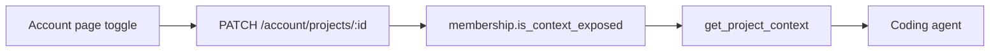

# 05 — Admin UI Patterns

## What We Built

Week 20 adds Account (`/account`) for per-project MCP exposure toggles, expands Projects with admin create/edit/archive/delete and member management (`/projects/:id`), and documents how role gates work in the SPA. Week 21’s Users page follows the same admin-gate pattern.

## Key Concepts

### Role-gated routes vs button hiding

Security lives on the **API** (`require_admin`, `require_project_owner_or_admin`, Casbin). The SPA adds UX gates so non-admins do not land on dead ends:

| Layer | Mechanism |
|-------|-----------|
| Route | `AdminRoute` — redirects non-admins from `/users` |
| Page | Early empty state if `me.role !== 'admin'` (defense in depth) |
| Controls | Hide “New project”, “Manage”, archive/delete for non-admins |

Hiding a button is **not** security — a crafted `PATCH /admin/users/{id}` still gets `403` from FastAPI.

### Admin tables

Users and project members use a simple HTML table (or divided list), not a heavy data-grid library. Prefer:

- Clear columns (email, role, active)
- Inline controls (Select for role, checkbox for active)
- Disable editing yourself where dangerous (cannot demote/deactivate own admin row)

### `is_context_exposed` ↔ MCP ProjectContext

Each **membership** row has `is_context_exposed`. When `true`, MCP tool `get_project_context` includes that project’s directory tree of KnowledgeNeurons + Commands for **that user**.

This is **per-user, per-project** — exposing a project for yourself does not expose it for teammates. Admins manage membership; each member controls their own MCP exposure.

### Owner vs admin

- **Application admin** (`users.role = admin`): create/delete/archive projects; manage all users; Casbin `*` policies.
- **Project owner** (`membership.role = owner`): update project metadata and members (API allows owner or admin).
- **Member**: browse directories they have Casbin READ/WRITE/MANAGE on; toggle own MCP exposure.

## Code Walkthrough

1. `features/account/` — `GET /account`, exposure mutation.
2. `features/projects/pages/ProjectDetailPage.tsx` — admin CRUD + members.
3. `features/auth/components/AdminRoute.tsx` — route gate for `/users`.

## Further Reading

- Backend: `api/docs/11-multi-tenant-project-scoping.md`, `api/docs/14-project-context-for-agents.md`
- Week 18 Query patterns: `client/docs/04-tanstack-query-patterns.md`

## Exercises (Optional)

1. Allow project **owners** (not only admins) to open `/projects/:id` using membership role from `/account`.
2. Show a badge on Projects list when `is_context_exposed` is true for the current user.
